<!-- One -->
<section id="one" class="wrapper style2 special">
	<header class="major">
		
ShipOS is an Open Source edge computing platform for ships. 
		The operating system enables a simple global development and deployment infrastructure. 
		It empowers anyone to develop and deploy apps for ships. 
		The vision is a democratic, crowd-sourced continuous improvement and innovation for the shipping industry.

		
A ShipOS Foundation is in the making - propelling ShipOS into the future.

	</header>
</section>

<!-- Two -->
<section id="two" class="wrapper">
	

		<section class="spotlight">
			

			

				<h3>Who can benefit from ShipOS?</h3>
				
As a ship owner, you can deploy applications fleet-wide to
				monitor every aspect of your ship. Get IoT data processed and
				transferred to shore for better business decisions.

				
Ship management will value the easy deployment and
				management of onboard software. It unifies software deployment
				and management on one hardware rig and with one common interface.

				
As a maritime software vendor, getting your software
				deployed to whole fleets has never been this easy. Join the
				new open market space for maritime software. Offer your
				applications to new customers like you would with apps on
				Google Play.

				
ShipOS is an open collaboration for a standard OS onboard
				ships. A Class Society’s needs for standardization and for
				relevant data can be efficiently realized.

			

		</section>
		<section class="spotlight">
			
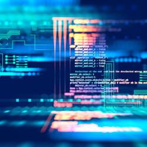

			

				<h3>Why should a software developer contribute?</h3>
				
Work with top Open Source developers with maritime
				expertise. Commit code that will push the maritime industry
				into the future. ShipOS has three main components - the Open
				Source Dolittle application management, Kubernetes and Clear
				Linux. The platform caters enables both microservices and
				larger applications running in containers. ShipOS enables
				marketplaces for deploying onboard applications - similar to
				Google Play on Android.

			

		</section>
		<section class="spotlight">
			
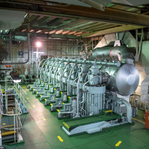

			

				<h3>Architecture</h3>
				
ShipOS is Open Source Software released under the MIT license. The ten core architecture principle of ShipOS are:
				<ol>
					<li>Standardization: Clear standardization of all components</li>
					<li>Security: Secure by default - zero-trust environment</li>
					<li>Stability: Work toward Telco software stability - at sea, IT is notoriously hard to fix</li>
					<li>Development: Avoid design by committee through clear responsibilities and core principles</li>
					<li>Privacy: Your data is your own - data-owners should consent to usage and be able to see who can see their data</li>
					<li>Containment: "Walled garden" principle - control allocation of resources to avoid noisy neighbors and (Quotas)</li>
					<li>Technology: Built on a modern software and hardware stack</li>
					<li>Simplicity: Limit the surface area to create a predictable platform (Linux, Docker, Kubernetes - no VMs and Windows)</li>
					<li>Connectivity: Connectivity is scarce and costly - QoS and prioritization needs to be on a ShipOS level</li>
					<li>Usability: Should be easy to use; think mobile app-stores for purchasing apps and capabilities</li>
				</ol>
				At the core of ShipOS is the concept of Event-Driven Architecture (EDA).

			

		</section>
		<section class="spotlight">
			
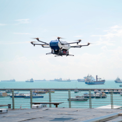

			

				<h3>Event-Driven Architecture</h3>
				
A usual morning in the Peterson family. Emma is screaming
				at his little brother Johnny after being pulled in the hair by
				the four year old. Dad is mitigating the ensuing fight. Mom is
				readying the lunch box for all three kids. Two kids dressed,
				one to go. Johnny needs to go, Dad undresses him and helps him
				on the toilet while big sister Chrissie helps Emma with the
				boots and discovers that Mom forgot the mustard in the lunch
				box. Mom swiftly handles the event. Chrissy is happy, Emma is
				ready and Johnny is almost dressed again. Daddy remembers some
				papers he needs for work. Mom takes over dressing Johnny while
				Dad pops into the living room. "Everybody ready?" Yup. Out the
				door, locks the door, into the car and to the kindergarden
				first. Then to Emma's school unless the traffic is heavy, then
				to Chrissie's school first. No day is the same. Lots of
				variables and lots of real-time events.

				
It would be next to impossible to have a set plan or
				process for a Peterson morning. An all-encompassing
				hierarcical and centrally coordinated command structure would
				be pretty useless. Everyone with kids would agree that one
				needs to be able to handle unforseen events every day. A
				family with kids can be described as "event driven". Everyone
				involved is acting in response to events that occur.
 
				
When complexity increases, monolithic solutions struggles.
				The old centrally coordinated software systems are ineffective
				in handling a multitude of unforseen events. To handle such
				complexities, you need an Event Driven Architecture (EDA).
				Think "microservices". Think Lego. You need a set of small
				software "Lego pieces" that respond to real-time events in a
				standardized fashion.

				
The Dolittle framework helps breaking your software into
				smaller pieces that are event-driven. It makes your software
				leaner, agile and responsive to real-time events. This has
				made it possible to create complex software solutions in
				record time. Wilhelmsen's Smart Rope solution and their
				Digiboiler software was created in just a few weeks weeks.

				
It is far easier to manage EDA software. Smaller pieces
				makes for easier debugging and faster development cycles.
				Pieces are more loosly coupled. Updates are easier and
				negative consequences from errors are more contained. All
				these benefits lower the cost of creating and managing the
				software.

			

		</section>
		<section class="major">
			

				<h3>Architecture insight</h3>
				
These set of architecture drawings will help you gain an insight into how ShipOS is structured.

				

				
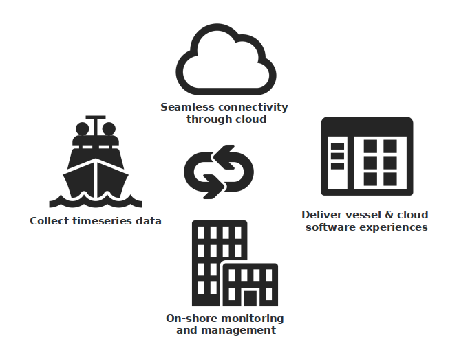

				
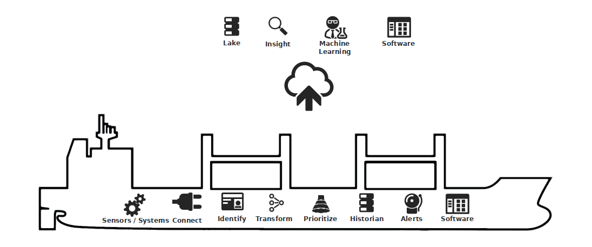

				
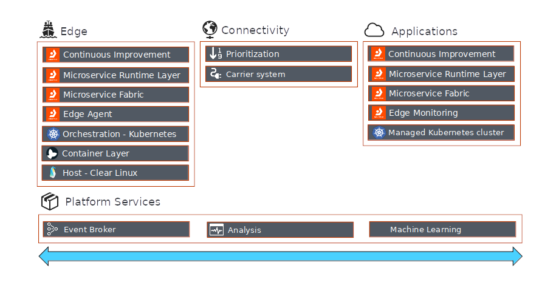

				
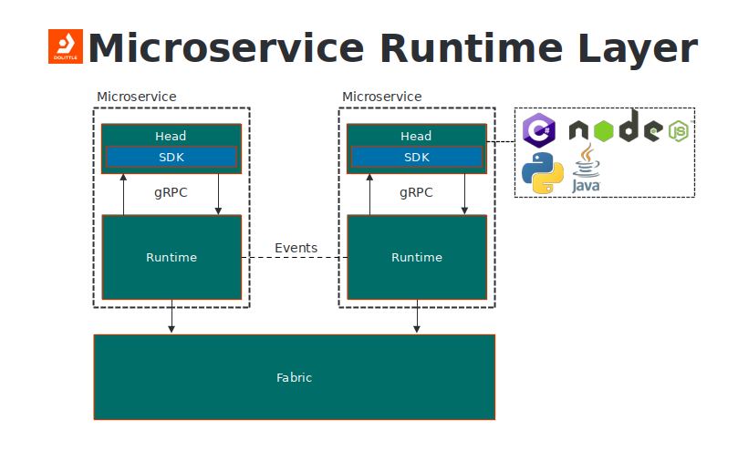

				
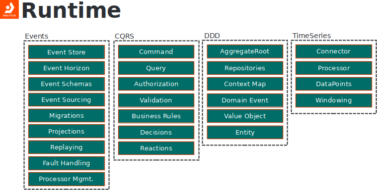

				
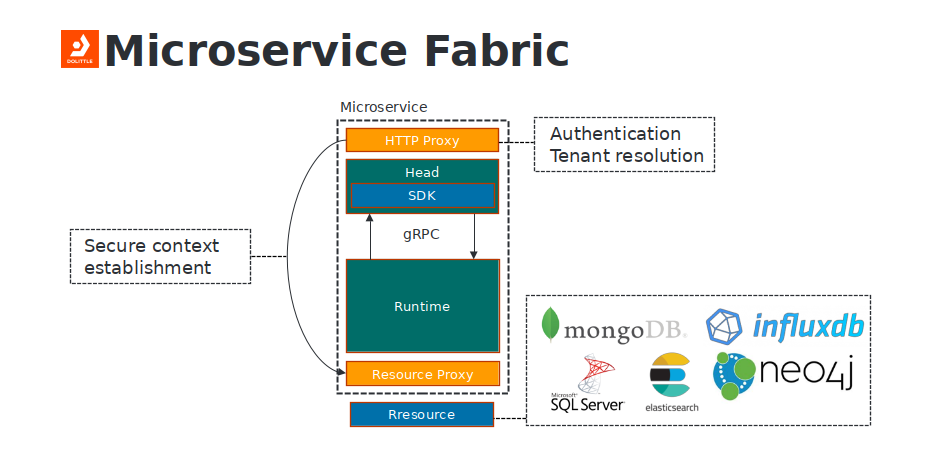

				
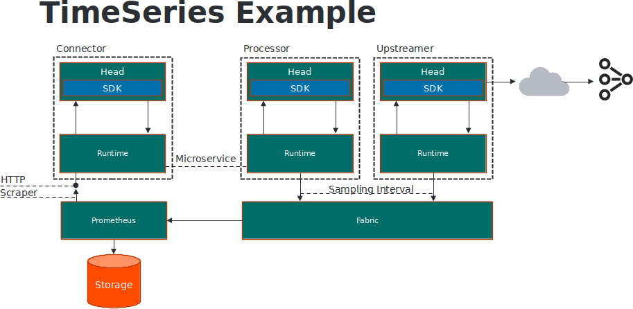

				
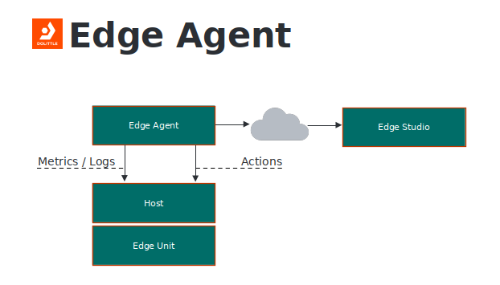

				
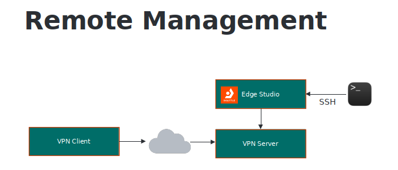

				

			

		</section>
		<section class="special">
			<ul class="icons labeled">
				<li><a href="https://www.youtube.com/watch?v=9cZXtmnMSRI">Architecture video</a></li>
				<li><a href="https://github.com/shipos-foundation">ShipOS code</a></li>
				<li><a href="https://dolittle.io/getting-started/quickstart/">Dolittle EDA quickstart</a></li>
			</ul>
		</section>
	

</section>
